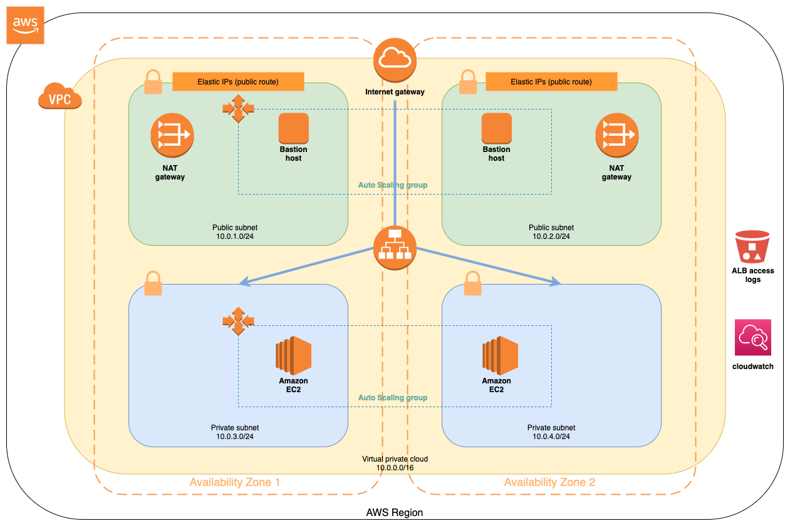

# Webservers Deployment on AWS Using Terraform

On the project, the following terraform providers used:
-  [hashicorp/template](https://www.terraform.io/docs/providers/template/d/file.html)
-  [hashicorp/aws](https://www.terraform.io/docs/providers/aws/index.html)
-  [trussworks/logs/aws](https://registry.terraform.io/modules/trussworks/logs/aws/4.1.1)

## Infrastructure Architecture


The project has three modules:
- networking: Deploy networking services such as VPC, Application Loadbalancer(ALB), Internet gateway, NAT gateway, Security Groups, and subnets. 
- computing: Deploy the Autoscaling group, which deploys bastion hosts and webservers through Availability Zones (AZs).
- aws_logs: Deploy S3 bucket for ALB access logs

## Requirements
To deploy the project, you will need an [AWS account](https://aws.amazon.com/) to follow along.The `profile` attribute on [providers.tf](./providers.tf) refers to the [AWS Config](https://docs.aws.amazon.com/cli/latest/userguide/cli-configure-files.html) File in `~/.aws/credentials` on MacOS and Linux. It is HashiCorp recommended practice that credentials never be hardcoded into *.tf configuration files.
To verify an AWS profile and ensure Terraform has correct provider credentials, install the [AWS CLI](https://docs.aws.amazon.com/cli/latest/userguide/cli-chap-install.html) and run `aws configure`. The AWS CLI will then verify and save your AWS Access Key ID and Secret Access Key. You can deploy the project locally or on Terraform Cloud as follow.
Generate an authentication key to connect to EC2 instances after infrastructure creation on your local environment:
```bash
ssh-keygen -f tf_cloud_demo
```
And now note the public key, `tf_cloud_demo.pub` and put it as `public_key` default value on [variables.tf](./variables.tf). There is two way to run this project:
* Local Environment
* Terraform Cloud

### Local Environment
On the first local deployment, install [Terraform](https://learn.hashicorp.com/terraform/getting-started/install.html) and using bellow command to initialize a new Terraform working directory by creating initial files, downloading modules, etc.
```HCL
terraform init 
```
Generate an execution plan for Terraform. execution plan can be reviewed before running apply to get a sense for what Terraform will do:
```HCL
terraform plan -out terraform.out
```
The plan can be saved to `terraform.out` plan file, and apply to take the plan file to execute plan exactly:
```HCL
terraform apply "terraform.out"
```
now you can access to Nginx web pages using `alb_dns_name` that's the last step output:
```bash
curl <alb_dns_name>
```
And use your key to connect to bastion hosts:
```bash
ssh -i <private key> ec2-user@<bastion host public IP>
```
### Terraform Cloud
Terraform Cloud is a service that makes it easy for teams to manage shared infrastructure with Terraform. The Terraform Cloud application, located at https://app.terraform.io, provides a UI and API to manage Terraform projects. Terraform Cloud offers a number of core features for free, as well as additional features in paid tiers. You can see a feature comparison here. When you host your project with Terraform Cloud, you can:
* Integrate with most popular version control systems.
* Manage your project's state, including state locking.
* Plan and apply configuration changes from within the Terraform Cloud UI.
* Securely store variables, including secret values.
* Store and use private Terraform modules.
* Collaborate with other users.

For start point, [create your terraform cloud account](https://learn.hashicorp.com/terraform/cloud-gettingstarted/tfc_signup), [create](https://learn.hashicorp.com/terraform/cloud-gettingstarted/tfc_create_workspace) and [setup](https://learn.hashicorp.com/terraform/cloud-gettingstarted/tfc_setup_workspace) workspace and at last, apply Configuration changes the projet and enjoy Terraform Cloud!


## Inputs
| Name | Description | Type | Default |
|------|-------------|------|---------|
|aws_region|[AWS Region](https://docs.aws.amazon.com/AWSEC2/latest/UserGuide/using-regions-availability-zones.html#concepts-available-regions) for deploy infrastructure|`string`|`us-east-1`|
|cidr_block|Virtual Private Cloud (VPC) CIDR block |`string`|`10.0.0.0/16`|
|availability_zones|Availability Zones list|`list`|`us-east-1a` , `us-east-1b`|
|dmz_public_cidrs|public CIDR blocks|`list`|`10.0.1.0/24` , `10.0.2.0/24`|
|app_private_cidrs|private CIDR blocks|`list`|`10.0.3.0/24` , `10.0.4.0/24`|
|accessip|access IP address that want to access|`string`|`0.0.0.0/0`|
|public_key|Public key that should use when want to connecting to bastion hosts|`string`|N/A|
|s3_bucket_name|ALB logs s3 bucket name|`string`|`tfclouddemo`|


## Outputs
| Name | Description |
|------|-------------|
|alb_dns_name|Application Loadbalancer Endpoint URL|